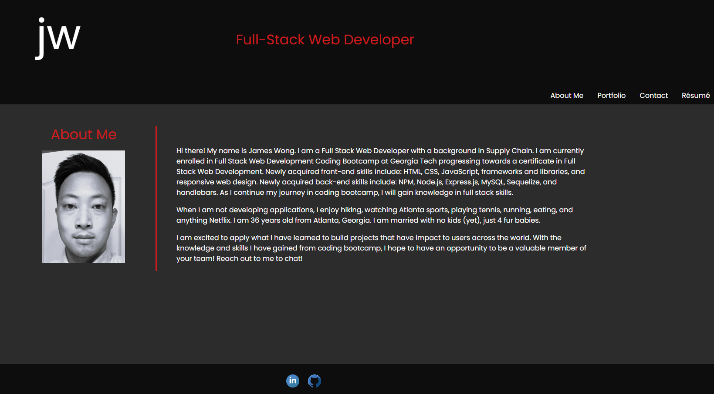
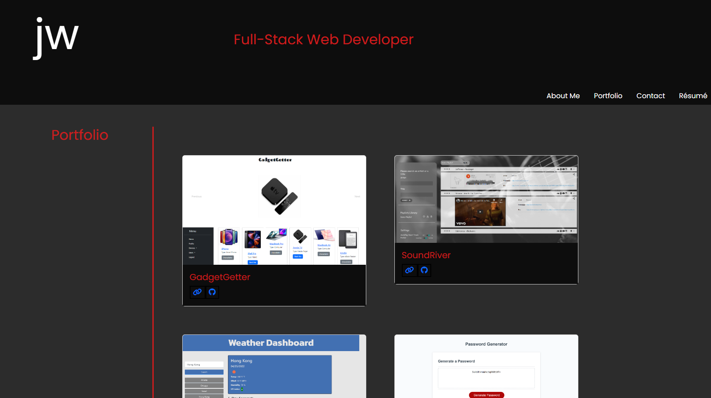
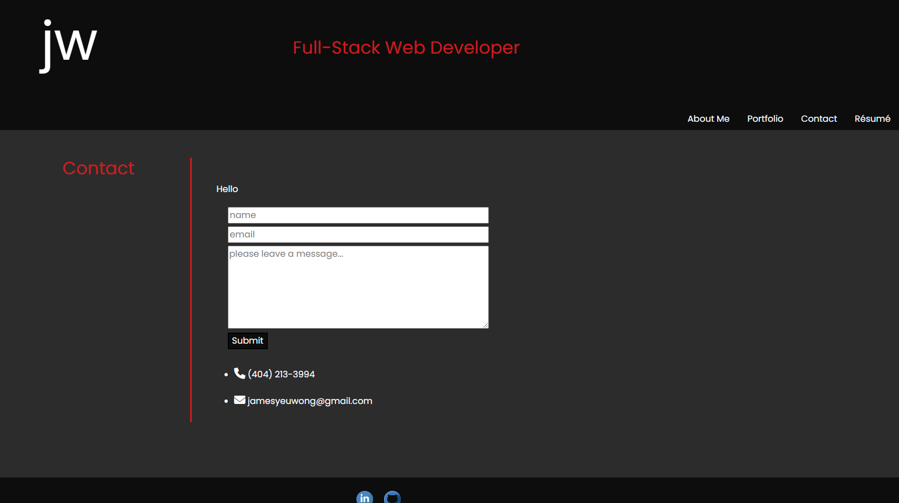
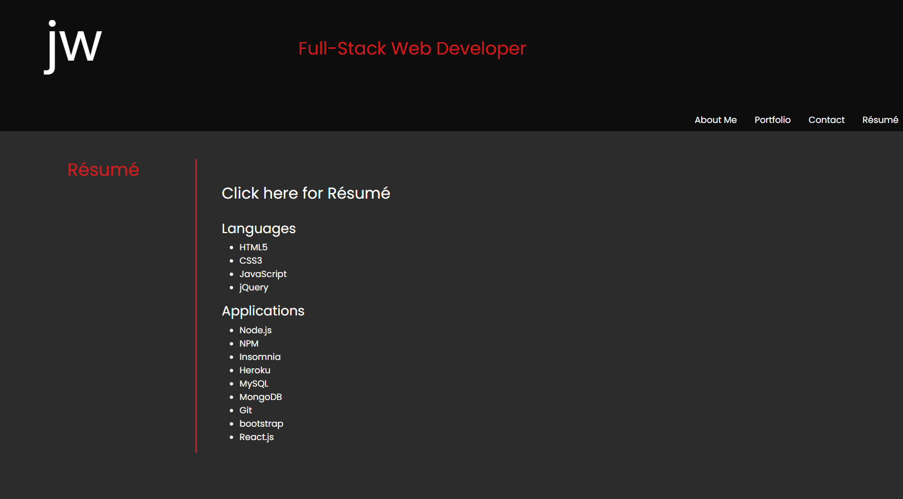

# React Portfolio

## Description

For this project, I re-created a professional portfolio page using React. I used the knowledge I have gained during the React portion of the bootcamp and applied it here.

## Purpose

The purpose of this project is to build a professional portfolio using React to showcase my skills. This will be sent to employers looking to fill positions. The portfolio must be able to allow potential employers to easily read a little bit about me, see my deployed projects, and contact me if necessary.

## Result

The below picture is the final result. This will continue to be a work in progress as I develop and learn new skills and deploy more complex projects.

About Me page shown on initial launch
>
>

Portfolio section displaying past projects
>
>

Contact section has a form to fill out that is currently not functional
>
>

Resume section includes downloadable resume and list of skills
>
>

## Languages Used

## Frameworks Used

## Link To Deployed Page

## Contact Information
 
Email: jamesyeuwong@gmail.com

## License

MIT License
 
Copyright (c) 2022 James Wong
 
Permission is hereby granted, free of charge, to any person obtaining a copy
of this software and associated documentation files (the "Software"), to deal
in the Software without restriction, including without limitation the rights
to use, copy, modify, merge, publish, distribute, sublicense, and/or sell
copies of the Software, and to permit persons to whom the Software is
furnished to do so, subject to the following conditions:
 
The above copyright notice and this permission notice shall be included in all
copies or substantial portions of the Software.
 
THE SOFTWARE IS PROVIDED "AS IS", WITHOUT WARRANTY OF ANY KIND, EXPRESS OR
IMPLIED, INCLUDING BUT NOT LIMITED TO THE WARRANTIES OF MERCHANTABILITY,
FITNESS FOR A PARTICULAR PURPOSE AND NONINFRINGEMENT. IN NO EVENT SHALL THE
AUTHORS OR COPYRIGHT HOLDERS BE LIABLE FOR ANY CLAIM, DAMAGES OR OTHER
LIABILITY, WHETHER IN AN ACTION OF CONTRACT, TORT OR OTHERWISE, ARISING FROM,
OUT OF OR IN CONNECTION WITH THE SOFTWARE OR THE USE OR OTHER DEALINGS IN THE
SOFTWARE.